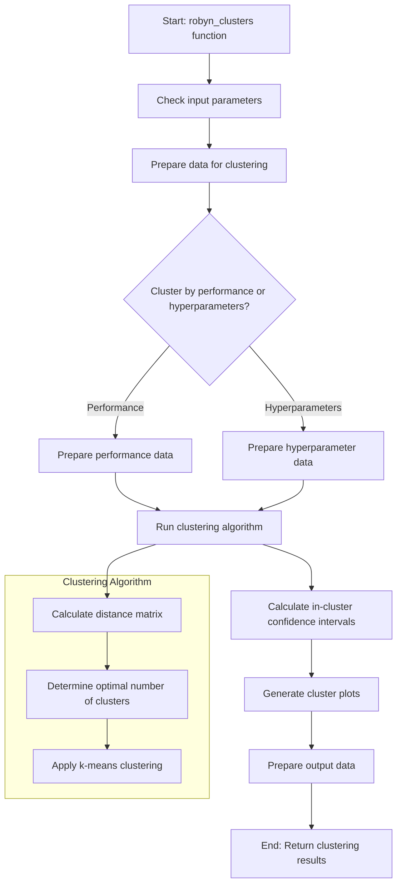
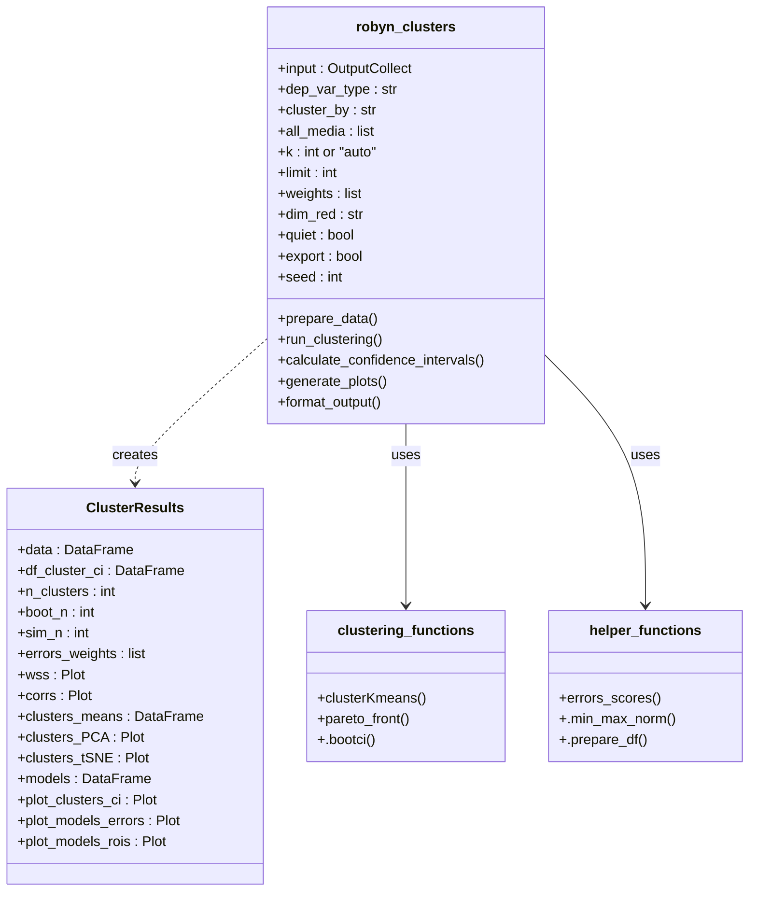

### Flowchart

```mermaid
graph TD
    A[Start: robyn_clusters function] --> B[Check input parameters]
    B --> C[Prepare data for clustering]
    C --> D{Cluster by performance or hyperparameters?}
    D -->|Performance| E[Prepare performance data]
    D -->|Hyperparameters| F[Prepare hyperparameter data]
    E --> G[Run clustering algorithm]
    F --> G
    G --> H[Calculate in-cluster confidence intervals]
    H --> I[Generate cluster plots]
    I --> J[Prepare output data]
    J --> K[End: Return clustering results]

    subgraph "Clustering Algorithm"
        G1[Calculate distance matrix]
        G2[Determine optimal number of clusters]
        G3[Apply k-means clustering]
    end
    G --> G1 --> G2 --> G3
```

### Class Diagram

```mermaid
classDiagram
    class robyn_clusters {
        +input : OutputCollect
        +dep_var_type : str
        +cluster_by : str
        +all_media : list
        +k : int or "auto"
        +limit : int
        +weights : list
        +dim_red : str
        +quiet : bool
        +export : bool
        +seed : int
        +prepare_data()
        +run_clustering()
        +calculate_confidence_intervals()
        +generate_plots()
        +format_output()
    }

    class ClusterResults {
        +data : DataFrame
        +df_cluster_ci : DataFrame
        +n_clusters : int
        +boot_n : int
        +sim_n : int
        +errors_weights : list
        +wss : Plot
        +corrs : Plot
        +clusters_means : DataFrame
        +clusters_PCA : Plot
        +clusters_tSNE : Plot
        +models : DataFrame
        +plot_clusters_ci : Plot
        +plot_models_errors : Plot
        +plot_models_rois : Plot
    }

    class clustering_functions {
        +clusterKmeans()
        +pareto_front()
        +.bootci()
    }

    class helper_functions {
        +errors_scores()
        +.min_max_norm()
        +.prepare_df()
    }

    robyn_clusters ..> ClusterResults : creates
    robyn_clusters --> clustering_functions : uses
    robyn_clusters --> helper_functions : uses
```
