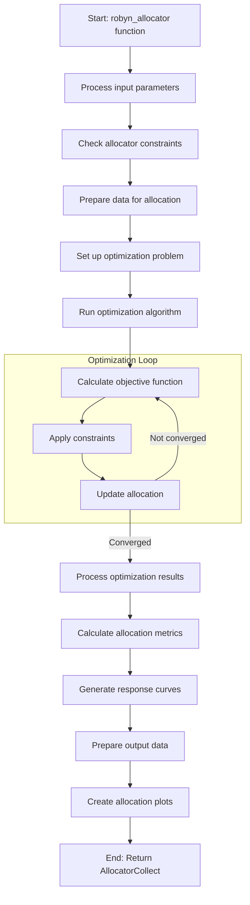
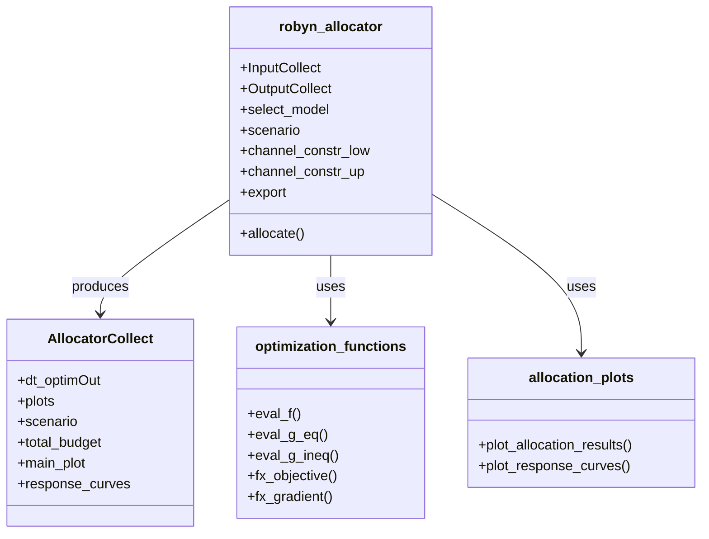

### Flowchart

```mermaid

graph TD
    A[Start: robyn_allocator function] --> B[Process input parameters]
    B --> C[Check allocator constraints]
    C --> D[Prepare data for allocation]
    D --> E[Set up optimization problem]
    E --> F[Run optimization algorithm]

    subgraph "Optimization Loop"
        F1[Calculate objective function]
        F2[Apply constraints]
        F3[Update allocation]
    end

    F --> F1 --> F2 --> F3
    F3 -->|Not converged| F1
    F3 -->|Converged| G[Process optimization results]

    G --> H[Calculate allocation metrics]
    H --> I[Generate response curves]
    I --> J[Prepare output data]
    J --> K[Create allocation plots]
    K --> L[End: Return AllocatorCollect]

```

### Class Diagram

```mermaid
classDiagram
    class robyn_allocator {
        +InputCollect
        +OutputCollect
        +select_model
        +scenario
        +channel_constr_low
        +channel_constr_up
        +export
        +allocate()
    }

    class AllocatorCollect {
        +dt_optimOut
        +plots
        +scenario
        +total_budget
        +main_plot
        +response_curves
    }

    class optimization_functions {
        +eval_f()
        +eval_g_eq()
        +eval_g_ineq()
        +fx_objective()
        +fx_gradient()
    }

    class allocation_plots {
        +plot_allocation_results()
        +plot_response_curves()
    }

    robyn_allocator --> AllocatorCollect : produces
    robyn_allocator --> optimization_functions : uses
    robyn_allocator --> allocation_plots : uses
```
