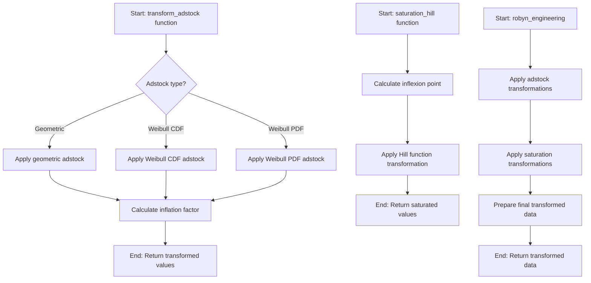
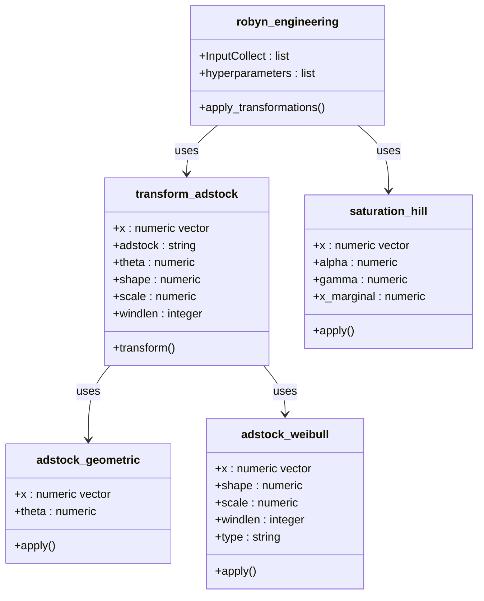

### Flowchart

```mermaid
graph TD
    A[Start: transform_adstock function] --> B{Adstock type?}
    B -->|Geometric| C[Apply geometric adstock]
    B -->|Weibull CDF| D[Apply Weibull CDF adstock]
    B -->|Weibull PDF| E[Apply Weibull PDF adstock]
    C --> F[Calculate inflation factor]
    D --> F
    E --> F
    F --> G[End: Return transformed values]

    H[Start: saturation_hill function] --> I[Calculate inflexion point]
    I --> J[Apply Hill function transformation]
    J --> K[End: Return saturated values]

    L[Start: robyn_engineering] --> M[Apply adstock transformations]
    M --> N[Apply saturation transformations]
    N --> O[Prepare final transformed data]
    O --> P[End: Return transformed data]
```

### Class Diagram

```mermaid
classDiagram
    class transform_adstock {
        +x : numeric vector
        +adstock : string
        +theta : numeric
        +shape : numeric
        +scale : numeric
        +windlen : integer
        +transform()
    }

    class adstock_geometric {
        +x : numeric vector
        +theta : numeric
        +apply()
    }

    class adstock_weibull {
        +x : numeric vector
        +shape : numeric
        +scale : numeric
        +windlen : integer
        +type : string
        +apply()
    }

    class saturation_hill {
        +x : numeric vector
        +alpha : numeric
        +gamma : numeric
        +x_marginal : numeric
        +apply()
    }

    class robyn_engineering {
        +InputCollect : list
        +hyperparameters : list
        +apply_transformations()
    }

    transform_adstock --> adstock_geometric : uses
    transform_adstock --> adstock_weibull : uses
    robyn_engineering --> transform_adstock : uses
    robyn_engineering --> saturation_hill : uses
```
