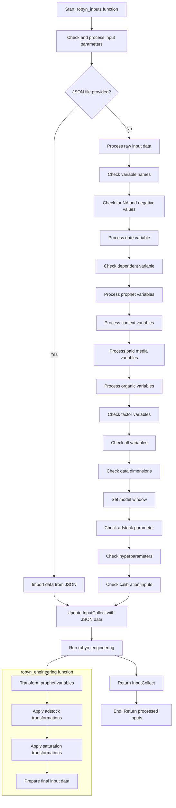
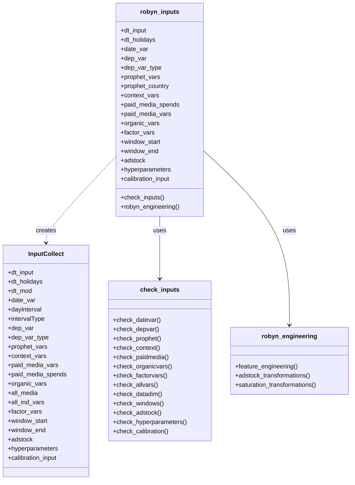

### Flow chart

```mermaid
graph TD
    A[Start: robyn_inputs function] --> B[Check and process input parameters]
    B --> C{JSON file provided?}
    C -->|Yes| D[Import data from JSON]
    C -->|No| E[Process raw input data]

    E --> F[Check variable names]
    F --> G[Check for NA and negative values]
    G --> H[Process date variable]
    H --> I[Check dependent variable]
    I --> J[Process prophet variables]
    J --> K[Process context variables]
    K --> L[Process paid media variables]
    L --> M[Process organic variables]
    M --> N[Check factor variables]
    N --> O[Check all variables]
    O --> P[Check data dimensions]
    P --> Q[Set model window]
    Q --> R[Check adstock parameter]
    R --> S[Check hyperparameters]
    S --> T[Check calibration inputs]

    D --> U[Update InputCollect with JSON data]
    T --> U

    U --> V[Run robyn_engineering]
    V --> W[Return InputCollect]
    W --> X[End: Return processed inputs]

    subgraph "robyn_engineering function"
        V1[Transform prophet variables]
        V2[Apply adstock transformations]
        V3[Apply saturation transformations]
        V4[Prepare final input data]
    end

    V --> V1 --> V2 --> V3 --> V4
```

### Class Diagram

```mermaid
classDiagram
    class robyn_inputs {
        +dt_input
        +dt_holidays
        +date_var
        +dep_var
        +dep_var_type
        +prophet_vars
        +prophet_country
        +context_vars
        +paid_media_spends
        +paid_media_vars
        +organic_vars
        +factor_vars
        +window_start
        +window_end
        +adstock
        +hyperparameters
        +calibration_input
        +check_inputs()
        +robyn_engineering()
    }

    class InputCollect {
        +dt_input
        +dt_holidays
        +dt_mod
        +date_var
        +dayInterval
        +intervalType
        +dep_var
        +dep_var_type
        +prophet_vars
        +context_vars
        +paid_media_vars
        +paid_media_spends
        +organic_vars
        +all_media
        +all_ind_vars
        +factor_vars
        +window_start
        +window_end
        +adstock
        +hyperparameters
        +calibration_input
    }

    class check_inputs {
        +check_datevar()
        +check_depvar()
        +check_prophet()
        +check_context()
        +check_paidmedia()
        +check_organicvars()
        +check_factorvars()
        +check_allvars()
        +check_datadim()
        +check_windows()
        +check_adstock()
        +check_hyperparameters()
        +check_calibration()
    }

    class robyn_engineering {
        +feature_engineering()
        +adstock_transformations()
        +saturation_transformations()
    }

    robyn_inputs ..> InputCollect : creates
    robyn_inputs --> check_inputs : uses
    robyn_inputs --> robyn_engineering : uses
```
