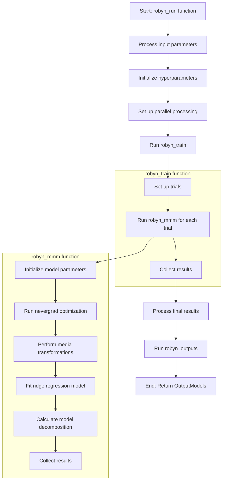
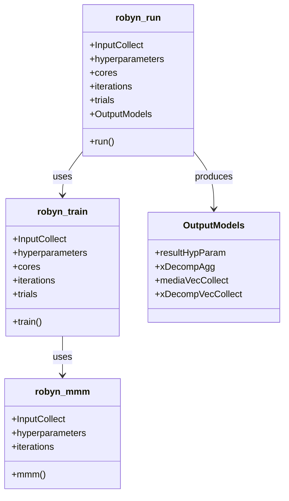

### Flow chart

```mermaid
graph TD
    A[Start: robyn_run function] --> B[Process input parameters]
    B --> C[Initialize hyperparameters]
    C --> D[Set up parallel processing]
    D --> E[Run robyn_train]

    subgraph "robyn_train function"
        E1[Set up trials]
        E2[Run robyn_mmm for each trial]
        E3[Collect results]
    end

    E --> E1 --> E2 --> E3

    subgraph "robyn_mmm function"
        F1[Initialize model parameters]
        F2[Run nevergrad optimization]
        F3[Perform media transformations]
        F4[Fit ridge regression model]
        F5[Calculate model decomposition]
        F6[Collect results]
    end

    E2 --> F1 --> F2 --> F3 --> F4 --> F5 --> F6

    E3 --> G[Process final results]
    G --> H[Run robyn_outputs]
    H --> I[End: Return OutputModels]
```

### Class diagram

```mermaid
classDiagram
    class robyn_run {
        +InputCollect
        +hyperparameters
        +cores
        +iterations
        +trials
        +OutputModels
        +run()
    }

    class robyn_train {
        +InputCollect
        +hyperparameters
        +cores
        +iterations
        +trials
        +train()
    }

    class robyn_mmm {
        +InputCollect
        +hyperparameters
        +iterations
        +mmm()
    }

    class OutputModels {
        +resultHypParam
        +xDecompAgg
        +mediaVecCollect
        +xDecompVecCollect
    }

    robyn_run --> robyn_train : uses
    robyn_train --> robyn_mmm : uses
    robyn_run --> OutputModels : produces
```
