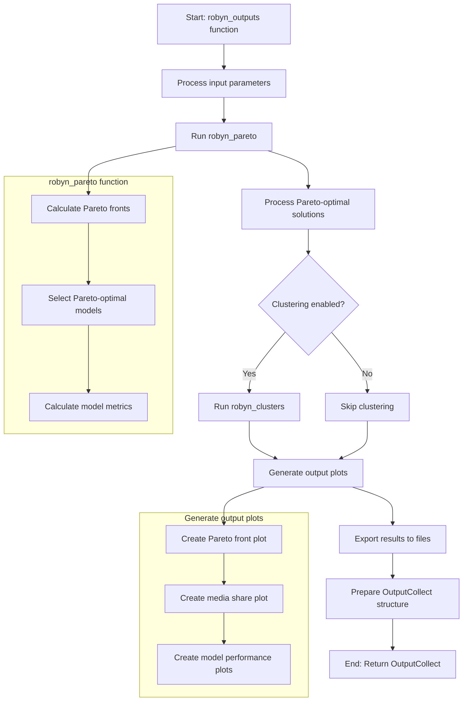
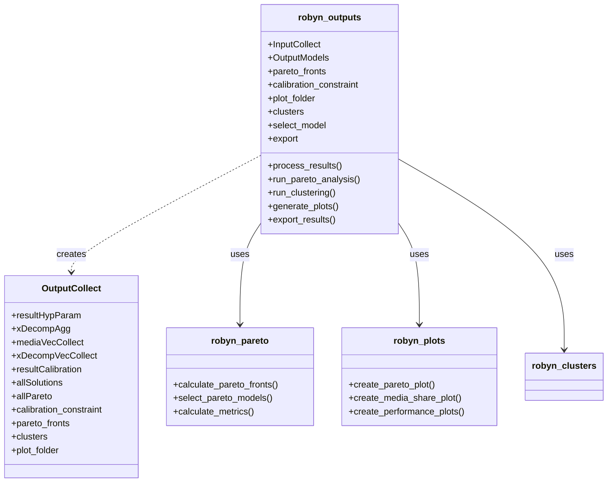

### Flowchart

```mermaid
graph TD
    A[Start: robyn_outputs function] --> B[Process input parameters]
    B --> C[Run robyn_pareto]
    C --> D[Process Pareto-optimal solutions]
    D --> E{Clustering enabled?}
    E -->|Yes| F[Run robyn_clusters]
    E -->|No| G[Skip clustering]
    F --> H[Generate output plots]
    G --> H
    H --> I[Export results to files]
    I --> J[Prepare OutputCollect structure]
    J --> K[End: Return OutputCollect]

    subgraph "robyn_pareto function"
        C1[Calculate Pareto fronts]
        C2[Select Pareto-optimal models]
        C3[Calculate model metrics]
    end
    C --> C1 --> C2 --> C3

    subgraph "Generate output plots"
        H1[Create Pareto front plot]
        H2[Create media share plot]
        H3[Create model performance plots]
    end
    H --> H1 --> H2 --> H3
```

### Class Diagram

```mermaid
classDiagram
    class robyn_outputs {
        +InputCollect
        +OutputModels
        +pareto_fronts
        +calibration_constraint
        +plot_folder
        +clusters
        +select_model
        +export
        +process_results()
        +run_pareto_analysis()
        +run_clustering()
        +generate_plots()
        +export_results()
    }

    class OutputCollect {
        +resultHypParam
        +xDecompAgg
        +mediaVecCollect
        +xDecompVecCollect
        +resultCalibration
        +allSolutions
        +allPareto
        +calibration_constraint
        +pareto_fronts
        +clusters
        +plot_folder
    }

    class robyn_pareto {
        +calculate_pareto_fronts()
        +select_pareto_models()
        +calculate_metrics()
    }

    class robyn_plots {
        +create_pareto_plot()
        +create_media_share_plot()
        +create_performance_plots()
    }

    robyn_outputs ..> OutputCollect : creates
    robyn_outputs --> robyn_pareto : uses
    robyn_outputs --> robyn_plots : uses
    robyn_outputs --> robyn_clusters : uses
```
