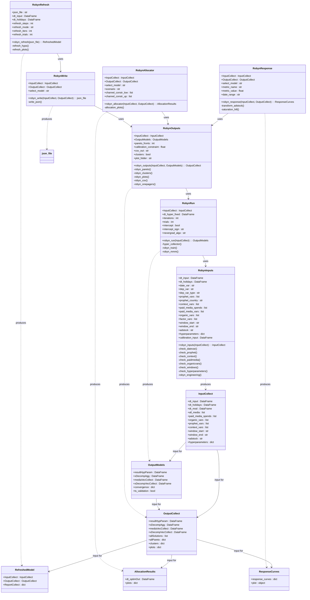

## Robyn MMM flowchart

```mermaid
graph TD
    A[Start] --> B[Load Data]
    B --> |dt_input, dt_holidays| C[robyn_inputs]

    subgraph "inputs.R"
        C --> D[check_datevar]
        C --> E[check_prophet]
        C --> F[check_context]
        C --> G[check_paidmedia]
        C --> H[check_organicvars]
        C --> I[check_windows]
        C --> J[check_hyperparameters]
        C --> K[robyn_engineering]
    end

    subgraph "transformation.R"
        K --> L[prophet_decomp]
        K --> M[run_transformations]
        M --> N[adstock_geometric / adstock_weibull]
        M --> O[saturation_hill]
    end

    C --> |InputCollect| P[robyn_run]

    subgraph "model.R"
        P --> Q[hyper_collector]
        P --> R[robyn_train]
        R --> S[robyn_mmm]
        S --> T[nloptr::nloptr]
        S --> U[glmnet::glmnet]
        S --> V[model_decomp]
    end

    P --> |OutputModels| W[robyn_outputs]

    subgraph "outputs.R"
        W --> X[robyn_pareto]
        W --> Y[robyn_clusters]
        W --> Z[robyn_plots]
        W --> AA[robyn_csv]
        W --> AB[robyn_onepagers]
    end

    subgraph "json.R"
        W --> |InputCollect, OutputCollect| AC[robyn_write]
        AC --> AD[write_json]
    end

    subgraph "allocator.R"
        W --> |InputCollect, OutputCollect| AE[robyn_allocator]
        AE --> AF[nloptr::nloptr]
        AE --> AG[allocation_plots]
    end

    subgraph "refresh.R"
        AC --> |json_file| AH[robyn_refresh]
        AH --> AI[refresh_hyps]
        AH --> AJ[robyn_run]
        AH --> AK[robyn_outputs]
        AH --> AL[refresh_plots]
    end

    subgraph "response.R"
        AM[robyn_response] --> AN[transform_adstock]
        AM --> AO[saturation_hill]
    end

    subgraph "json.R"
        AP[robyn_recreate] --> AQ[robyn_read]
        AP --> AR[robyn_inputs]
        AP --> AS[robyn_run]
    end

    C --> |InputCollect| AT[Output: InputCollect]
    P --> |OutputModels| AU[Output: OutputModels]
    W --> |plots, csv files| AV[Output: Plots and CSV files]
    AC --> |json_file| AW[Output: JSON file]
    AE --> |allocation results| AX[Output: Allocation results]
    AH --> |refreshed model| AY[Output: Refreshed model]
    AM --> |response curves| AZ[Output: Response curves]
```

### Class Diagram

```mermaid
classDiagram
    class RobynInputs {
        +dt_input : DataFrame
        +dt_holidays : DataFrame
        +date_var : str
        +dep_var : str
        +dep_var_type : str
        +prophet_vars : list
        +prophet_country : str
        +context_vars : list
        +paid_media_spends : list
        +paid_media_vars : list
        +organic_vars : list
        +factor_vars : list
        +window_start : str
        +window_end : str
        +adstock : str
        +hyperparameters : dict
        +calibration_input : DataFrame
        +robyn_inputs(InputCollect) : InputCollect
        -check_datevar()
        -check_prophet()
        -check_context()
        -check_paidmedia()
        -check_organicvars()
        -check_windows()
        -check_hyperparameters()
        -robyn_engineering()
    }

    class RobynRun {
        +InputCollect : InputCollect
        +dt_hyper_fixed : DataFrame
        +iterations : int
        +trials : int
        +intercept : bool
        +intercept_sign : str
        +nevergrad_algo : str
        +robyn_run(InputCollect) : OutputModels
        -hyper_collector()
        -robyn_train()
        -robyn_mmm()
    }

    class RobynOutputs {
        +InputCollect : InputCollect
        +OutputModels : OutputModels
        +pareto_fronts : int
        +calibration_constraint : float
        +csv_out : str
        +clusters : bool
        +plot_folder : str
        +robyn_outputs(InputCollect, OutputModels) : OutputCollect
        -robyn_pareto()
        -robyn_clusters()
        -robyn_plots()
        -robyn_csv()
        -robyn_onepagers()
    }

    class RobynWrite {
        +InputCollect : InputCollect
        +OutputCollect : OutputCollect
        +select_model : str
        +robyn_write(InputCollect, OutputCollect) : json_file
        -write_json()
    }

    class RobynAllocator {
        +InputCollect : InputCollect
        +OutputCollect : OutputCollect
        +select_model : str
        +scenario : str
        +channel_constr_low : list
        +channel_constr_up : list
        +robyn_allocator(InputCollect, OutputCollect) : AllocationResults
        -allocation_plots()
    }

    class RobynRefresh {
        +json_file : str
        +dt_input : DataFrame
        +dt_holidays : DataFrame
        +refresh_steps : int
        +refresh_mode : str
        +refresh_iters : int
        +refresh_trials : int
        +robyn_refresh(json_file) : RefreshedModel
        -refresh_hyps()
        -refresh_plots()
    }

    class RobynResponse {
        +InputCollect : InputCollect
        +OutputCollect : OutputCollect
        +select_model : str
        +metric_name : str
        +metric_value : float
        +date_range : str
        +robyn_response(InputCollect, OutputCollect) : ResponseCurves
        -transform_adstock()
        -saturation_hill()
    }

    class InputCollect {
        +dt_input : DataFrame
        +dt_holidays : DataFrame
        +dt_mod : DataFrame
        +all_media : list
        +paid_media_spends : list
        +organic_vars : list
        +prophet_vars : list
        +context_vars : list
        +window_start : str
        +window_end : str
        +adstock : str
        +hyperparameters : dict
    }

    class OutputModels {
        +resultHypParam : DataFrame
        +xDecompAgg : DataFrame
        +mediaVecCollect : DataFrame
        +xDecompVecCollect : DataFrame
        +convergence : dict
        +ts_validation : bool
    }

    class OutputCollect {
        +resultHypParam : DataFrame
        +xDecompAgg : DataFrame
        +mediaVecCollect : DataFrame
        +xDecompVecCollect : DataFrame
        +allSolutions : list
        +allPareto : dict
        +clusters : dict
        +plots : dict
    }

    class AllocationResults {
        +dt_optimOut : DataFrame
        +plots : dict
    }

    class RefreshedModel {
        +InputCollect : InputCollect
        +OutputCollect : OutputCollect
        +ReportCollect : dict
    }

    class ResponseCurves {
        +response_curves : dict
        +plot : object
    }

    RobynInputs ..> InputCollect : produces
    RobynRun ..> OutputModels : produces
    RobynOutputs ..> OutputCollect : produces
    RobynWrite ..> json_file : produces
    RobynAllocator ..> AllocationResults : produces
    RobynRefresh ..> RefreshedModel : produces
    RobynResponse ..> ResponseCurves : produces

    RobynRun --> RobynInputs : uses
    RobynOutputs --> RobynRun : uses
    RobynWrite --> RobynOutputs : uses
    RobynAllocator --> RobynOutputs : uses
    RobynRefresh --> RobynWrite : uses
    RobynResponse --> RobynOutputs : uses

    InputCollect --> OutputModels : input for
    OutputModels --> OutputCollect : input for
    InputCollect --> OutputCollect : input for
    OutputCollect --> AllocationResults : input for
    OutputCollect --> RefreshedModel : input for
    OutputCollect --> ResponseCurves : input for
```
