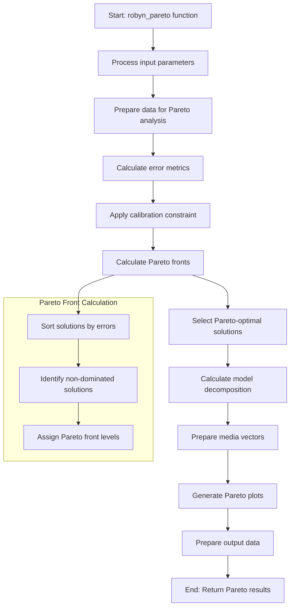
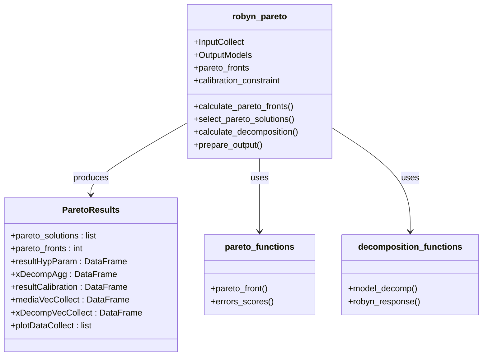

### Flowchart

```mermaid
graph TD
    A[Start: robyn_pareto function] --> B[Process input parameters]
    B --> C[Prepare data for Pareto analysis]
    C --> D[Calculate error metrics]
    D --> E[Apply calibration constraint]
    E --> F[Calculate Pareto fronts]
    F --> G[Select Pareto-optimal solutions]
    G --> H[Calculate model decomposition]
    H --> I[Prepare media vectors]
    I --> J[Generate Pareto plots]
    J --> K[Prepare output data]
    K --> L[End: Return Pareto results]

    subgraph "Pareto Front Calculation"
        F1[Sort solutions by errors]
        F2[Identify non-dominated solutions]
        F3[Assign Pareto front levels]
    end
    F --> F1 --> F2 --> F3
```

### Class Diagram

```mermaid
classDiagram
    class robyn_pareto {
        +InputCollect
        +OutputModels
        +pareto_fronts
        +calibration_constraint
        +calculate_pareto_fronts()
        +select_pareto_solutions()
        +calculate_decomposition()
        +prepare_output()
    }

    class ParetoResults {
        +pareto_solutions : list
        +pareto_fronts : int
        +resultHypParam : DataFrame
        +xDecompAgg : DataFrame
        +resultCalibration : DataFrame
        +mediaVecCollect : DataFrame
        +xDecompVecCollect : DataFrame
        +plotDataCollect : list
    }

    class pareto_functions {
        +pareto_front()
        +errors_scores()
    }

    class decomposition_functions {
        +model_decomp()
        +robyn_response()
    }

    robyn_pareto --> ParetoResults : produces
    robyn_pareto --> pareto_functions : uses
    robyn_pareto --> decomposition_functions : uses
```
