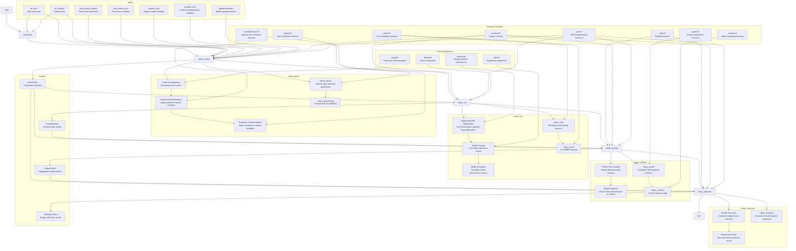

## Robyn MMM workflow

```mermaid
graph TD
    A[Start] --> B[Load Data]
    B --> C[robyn_inputs]
    C --> D[robyn_run]
    D --> E[robyn_outputs]
    E --> F[robyn_allocator]
    F --> G[End]

    subgraph "robyn_inputs"
        C1[Feature Engineering<br>Decompose time series]
        C2[Adstock Transformations<br>Apply adstock to media variables]
        C3[Saturation Transformations<br>Apply saturation to media variables]
        C4[check_inputs<br>Validate input data and parameters]
        C5[robyn_engineering<br>Prepare data for modeling]
    end

    subgraph "robyn_run"
        D1[Hyperparameter Optimization<br>Use Nevergrad to optimize hyperparameters]
        D2[Model Training<br>Train ridge regression model]
        D3[Model Evaluation<br>Calculate model performance metrics]
        D4[robyn_train<br>Manage model training process]
        D5[robyn_mmm<br>Core MMM function]
    end

    subgraph "robyn_outputs"
        E1[Pareto Front Analysis<br>Identify efficient model solutions]
        E2[Model Selection<br>Choose best model based on criteria]
        E3[robyn_pareto<br>Calculate Pareto-optimal solutions]
        E4[robyn_clusters<br>Cluster similar models]
    end

    subgraph "robyn_allocator"
        F1[Budget Allocation<br>Optimize budget across channels]
        F2[Response Curves<br>Generate media response curves]
        F3[robyn_response<br>Calculate channel-specific responses]
    end

    C --> C1 --> C2 --> C3
    C --> C4 --> C5
    D --> D1 --> D2 --> D3
    D --> D4 --> D5
    E --> E1 --> E2
    E --> E3 --> E4
    F --> F1 --> F2
    F --> F3

    subgraph "Inputs"
        H1[dt_input<br>Main input data]
        H2[dt_holidays<br>Holiday data]
        H3[paid_media_spends<br>Paid media spend data]
        H4[paid_media_vars<br>Paid media variables]
        H5[organic_vars<br>Organic media variables]
        H6[prophet_vars<br>Prophet decomposition variables]
        H7[hyperparameters<br>Model hyperparameters]
    end

    subgraph "Outputs"
        I1[InputCollect<br>Processed input data]
        I2[OutputModels<br>Trained model results]
        I3[OutputCollect<br>Aggregated model outputs]
        I4[AllocatorCollect<br>Budget allocation results]
    end

    H1 --> B
    H2 --> B
    H1 --> C
    H2 --> C
    H3 --> C
    H4 --> C
    H5 --> C
    H6 --> C
    H7 --> C
    C --> I1
    I1 --> D
    D --> I2
    I1 --> E
    I2 --> E
    E --> I3
    I1 --> F
    I3 --> F
    F --> I4

    subgraph "Auxiliary Functions"
        J1[checks.R<br>Input validation functions]
        J2[transformations.R<br>Adstock and saturation functions]
        J3[model.R<br>Core modeling functions]
        J4[pareto.R<br>Pareto optimization functions]
        J5[clusters.R<br>Model clustering functions]
        J6[plots.R<br>Plotting functions]
        J7[auxiliary.R<br>Helper functions]
        J8[json.R<br>JSON import/export functions]
    end

    J1 --> C4
    J2 --> C2
    J2 --> C3
    J3 --> D4
    J3 --> D5
    J4 --> E3
    J5 --> E4
    J6 --> E
    J6 --> F
    J7 --> C
    J7 --> D
    J7 --> E
    J7 --> F
    J8 --> C
    J8 --> D
    J8 --> E
    J8 --> F

    subgraph "External Libraries"
        K1[nevergrad<br>Hyperparameter optimization]
        K2[reticulate<br>Python integration]
        K3[prophet<br>Time series decomposition]
        K4[glmnet<br>Regularized regression]
    end

    K1 --> D1
    K2 --> D
    K3 --> C1
    K4 --> D2
```
