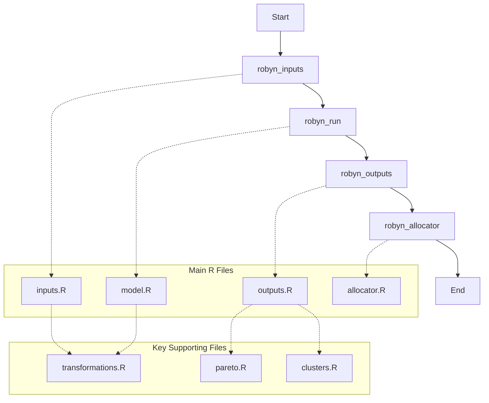

### Modeling Component

```mermaid
graph TD
    A[Start] --> B[robyn_inputs]
    B --> C[robyn_run]
    C --> D[robyn_outputs]
    D --> E[robyn_allocator]
    E --> F[End]

    subgraph "Main R Files"
        R1[inputs.R]
        R2[model.R]
        R3[outputs.R]
        R4[allocator.R]
    end

    B -.-> R1
    C -.-> R2
    D -.-> R3
    E -.-> R4

    subgraph "Key Supporting Files"
        S1[transformations.R]
        S2[pareto.R]
        S3[clusters.R]
    end

    R1 -.-> S1
    R2 -.-> S1
    R3 -.-> S2
    R3 -.-> S3
```

#### R reference files
