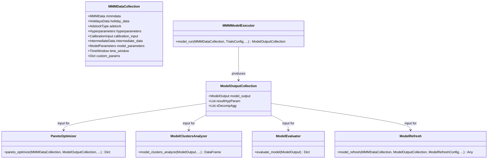

```mermaid
classDiagram
    class MMMDataCollection {
        +MMMData mmmdata
        +HolidaysData holiday_data
        +AdstockType adstock
        +Hyperparameters hyperparameters
        +CalibrationInput calibration_input
        +IntermediateData intermediate_data
        +ModelParameters model_parameters
        +TimeWindow time_window
        +Dict custom_params
    }
    class MMMModelExecutor {
        +model_run(MMMDataCollection, TrialsConfig, ...) ModelOutputCollection
    }
    class ModelOutputCollection {
        +ModelOutput model_output
        +List resultHypParam
        +List xDecompAgg
    }
    class ParetoOptimizer {
        +pareto_optimize(MMMDataCollection, ModelOutputCollection, ...) Dict
    }
    class ModelClustersAnalyzer {
        +model_clusters_analyze(ModelOutput, ...) DataFrame
    }
    class ModelEvaluator {
        +evaluate_model(ModelOutput) Dict
    }
    class ModelRefresh {
        +model_refresh(MMMDataCollection, ModelOutputCollection, ModelRefreshConfig, ...) Any
    }
    MMMModelExecutor --> ModelOutputCollection : produces
    ModelOutputCollection --> ParetoOptimizer : input for
    ModelOutputCollection --> ModelClustersAnalyzer : input for
    ModelOutputCollection --> ModelEvaluator : input for
    ModelOutputCollection --> ModelRefresh : input for
```
