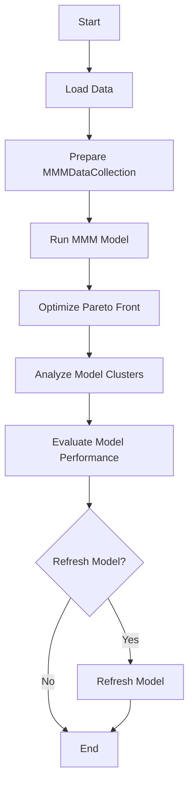

```mermaid
graph TD
    A[Start] --> B[Load Data]
    B --> C[Prepare MMMDataCollection]
    C --> D[Run MMM Model]
    D --> E[Optimize Pareto Front]
    E --> F[Analyze Model Clusters]
    F --> G[Evaluate Model Performance]
    G --> H{Refresh Model?}
    H -- Yes --> I[Refresh Model]
    H -- No --> J[End]
    I --> J
```
